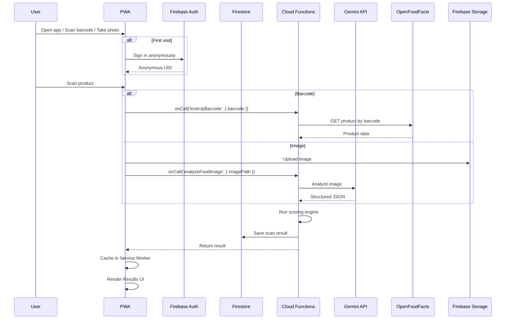

# PROJECT BRIEF: Food Scanner App (PWA + Firebase)

**Status**: Planning Complete · **Last Updated**: June 3, 2026

---

## 📋 Project Overview

A cross-platform **Progressive Web App** that lets users scan food via **camera**, **barcode**, **photo upload**, or **text search** and returns a **balanced "Good & Bad" review** — highlighting nutritional positives (fiber, protein, certifications) alongside risks (additives, processing level, allergens) through a multi-metric scoring system.

---

## 🔥 Complete Firebase Stack

| Need | Firebase Service | Purpose |
|------|------------------|---------|
| **User Auth** | **Firebase Authentication** | Anonymous (scan-first), Google, Apple |
| **Database** | **Firestore** | Real-time sync, offline persistence, scan history |
| **File Storage** | **Firebase Storage** | Save scanned food photos for re-analysis |
| **Backend Logic** | **Firebase Cloud Functions** | Gemini AI calls, scoring engine, barcode lookup |
| **Hosting** | **Firebase Hosting** | HTTPS, CDN, single-command deploy for PWA |
| **AI / Vision** | **Gemini API (via Cloud Functions)** | Image analysis → structured food data |
| **Offline** | **Firestore Offline Persistence** + **Service Worker** | Full offline barcode lookup & history |
| **Push** | **Firebase Cloud Messaging (FCM)** | Scan completion alerts, weekly summaries |
| **Analytics** | **Google Analytics for Firebase** | Track scans, popular features, engagement |
| **Config** | **Firebase Remote Config** | A/B test scoring thresholds, feature flags |
| **Performance** | **Firebase Performance Monitoring** | Monitor scan latency, Cloud Function speed |

---

## 🏗 Tech Stack

| Layer | Technology |
|-------|-----------|
| **Framework** | **Next.js** (App Router) — best PWA support + SSR |
| **PWA Layer** | `next-pwa` or `@serwist/next` — manifest, service worker, offline page |
| **UI Library** | **Tailwind CSS** + **shadcn/ui** |
| **Camera** | **WebRTC** (`navigator.mediaDevices.getUserMedia`) |
| **Barcode** | **`html5-qrcode`** or **`zbar-wasm`** — pure JS WebAssembly |
| **State Mgmt** | **Zustand** (persisted to IndexedDB) |
| **Charts** | **Recharts** or **D3.js** |
| **Icons** | **Lucide React** |

---

## 📁 Project Structure

```
food-scanner-app/
├── public/
│   ├── manifest.json              # PWA manifest
│   ├── sw.js                      # Service Worker
│   ├── index.html
│   └── icons/                     # 192px, 512px, maskable icons
├── src/
│   ├── app/                       # Next.js App Router
│   │   ├── page.tsx               # Home / Camera
│   │   ├── scan/
│   │   │   └── page.tsx           # Scanner page
│   │   ├── results/
│   │   │   └── [id].tsx           # Scan results (Good & Bad)
│   │   ├── history/
│   │   │   └── page.tsx           # Scan history
│   │   ├── profile/
│   │   │   └── page.tsx           # User preferences
│   │   └── compare/
│   │       └── page.tsx           # Product comparison
│   ├── components/
│   │   ├── scanner/
│   │   │   ├── CameraScanner.tsx   # WebRTC camera
│   │   │   ├── BarcodeScanner.tsx  # html5-qrcode
│   │   │   └── PhotoUpload.tsx     # File upload
│   │   ├── results/
│   │   │   ├── HealthScoreGauge.tsx
│   │   │   ├── GoodBadCard.tsx
│   │   │   ├── NutriScoreBadge.tsx
│   │   │   └── AlternativesList.tsx
│   │   └── ui/                    # Reusable primitives
│   ├── lib/
│   │   ├── firebase.ts            # Firebase init
│   │   ├── firestore.ts           # Firestore helpers
│   │   ├── functions.ts           # Callable Cloud Function wrappers
│   │   └── scoring.ts             # Client-side display helpers
│   ├── hooks/
│   │   ├── useCamera.ts
│   │   ├── useBarcode.ts
│   │   └── useScanHistory.ts
│   └── types/
│       └── index.ts
├── functions/                     # Firebase Cloud Functions
│   ├── src/
│   │   ├── index.ts               # Function exports
│   │   ├── scan.ts                # lookUpBarcode, analyzeFoodImage
│   │   ├── scoring.ts             # Scoring engine
│   │   ├── recommendations.ts     # Alternative product finder
│   │   └── weekly-summary.ts      # Scheduled cron function
│   ├── package.json
│   └── tsconfig.json
├── firestore.rules
├── firestore.indexes.json
├── firebase.json
└── .firebaserc
```

---

## 🔄 Data Flow



---

## 🎯 The "Good & Bad" Scoring Engine

### The "Good" Side

| Metric | Source | Display |
|--------|--------|---------|
| **Health Score** (0–100) | Weighted algorithm | Large circular gauge |
| **Nutri-Score** (A–E) | Fiber, protein, sat fat, sugar, salt | Color badge |
| **Beneficial Nutrients** | Protein, fiber, vitamins | Green checkmarks |
| **Certifications** | Organic, Vegan, Fair Trade | Badge icons |
| **Minimal Processing** | NOVA 1–2 | Green label |
| **Eco-Score** | Packaging, origin, carbon footprint | Leaf icon |

### The "Bad" Side

| Metric | Source | Display |
|--------|--------|---------|
| **Risk Score** (0–100) | Inverse of health score | Red gauge |
| **NOVA Class** (1–4) | Processing level | Warning label (3–4) |
| **Red Flags** | Trans fats, excess sugar, sodium | Red exclamation list |
| **Allergen Alerts** | User profile vs. ingredients | Red banner |
| **Negative Additives** | Artificial colors, sweeteners | Caution list |

### Scoring Algorithm (Pseudocode)

```
function calculateHealthScore(product):
    good = 0; bad = 0
    good += fiber_score(product.fiber)         // 0 to +15
    good += protein_quality(product.protein)    // 0 to +10
    good += fruit_veg_percent(product)          // 0 to +10
    good += certification_bonus(product)        // 0 to +5

    bad += sugar_penalty(product.sugar)         // 0 to -15
    bad += sat_fat_penalty(product.sat_fat)     // 0 to -10
    bad += sodium_penalty(product.sodium)       // 0 to -10
    bad += nova_penalty(product.nova_grade)     // 0 to -15
    bad += additive_penalty(product.additives)  // 0 to -10

    raw = good + bad                            // Range: -50 to +50
    health_score = normalize_to_100(raw)

    return { health_score, good_factors, bad_factors,
             nutriscore, ecoscore }
```

---

## 📱 PWA Manifest

```json
{
  "name": "FoodLens",
  "short_name": "FoodLens",
  "start_url": "/",
  "display": "standalone",
  "background_color": "#ffffff",
  "theme_color": "#10b981",
  "categories": ["health", "food", "lifestyle"],
  "icons": [
    { "src": "/icons/icon-192.png", "sizes": "192x192", "type": "image/png" },
    { "src": "/icons/icon-512.png", "sizes": "512x512", "type": "image/png" },
    { "src": "/icons/icon-512-maskable.png", "sizes": "512x512", "type": "image/png", "purpose": "maskable" }
  ],
  "shortcuts": [
    { "name": "Scan Food", "short_name": "Scan", "url": "/scan" },
    { "name": "History", "short_name": "History", "url": "/history" }
  ]
}
```

### Service Worker Caching Strategy

| Resource | Strategy |
|----------|----------|
| Barcode lookups, product data | **Cache-first** (fast offline) |
| Scan results | **Network-first** (latest data, cache fallback) |
| UI assets, app shell | **Stale-while-revalidate** |

---

## 📋 Results Screen Layout

```
┌─────────────────────────────────┐
│  🍪 Chocolate Chip Cookie       │
│  [Product Image]                │
├─────────────────────────────────┤
│  ┌───┐   ┌───────┐             │
│  │ 72│   │ B     │             │
│  │ ⬤ │   │Nutri  │             │
│  │   │   │Score  │             │
│  └───┘   └───────┘             │
│  Health Score    Nutri-Score    │
├─────────────────────────────────┤
│ ✅ THE GOOD                     │
│  • High in fiber (+15)         │
│  • Good protein source (+8)    │
│  • Organic certified (+5)      │
│  • Low sodium (+3)             │
├─────────────────────────────────┤
│ ⚠️ THE BAD                     │
│  • Ultra-processed (NOVA 4)    │
│  • High sugar: 22g (-12)       │
│  • Contains palm oil (-5)      │
│  • Artificial flavors (-3)     │
├─────────────────────────────────┤
│ 🥇 Healthier Alternatives       │
│  [Product A]  [Product B]      │
├─────────────────────────────────┤
│ [Save]  [Share]  [Compare]     │
└─────────────────────────────────┘
```

---

## 🗺 Implementation Roadmap

### Phase 1: PWA Foundation (Week 1)

| Step | Task |
|------|------|
| 1.1 | `npx create-next-app@latest` — TypeScript + Tailwind |
| 1.2 | Configure `next-pwa` — manifest.json, service worker, offline fallback |
| 1.3 | Firebase project setup — Auth, Firestore, Functions, Hosting |
| 1.4 | Initialize Firebase SDK (`src/lib/firebase.ts`) |
| 1.5 | Deploy empty app to Firebase Hosting |

### Phase 2: Scanning (Week 2)

| Step | Task |
|------|------|
| 2.1 | Build **CameraScanner** component (WebRTC + canvas capture) |
| 2.2 | Build **BarcodeScanner** component (`html5-qrcode`) |
| 2.3 | Build **PhotoUpload** component (drag & drop + file picker) |
| 2.4 | Create **Scan page** with all three input modes |

### Phase 3: Backend — Cloud Functions (Week 3)

| Step | Task |
|------|------|
| 3.1 | `firebase init functions` — TypeScript setup |
| 3.2 | **`lookUpBarcode`** — Open Food Facts API integration |
| 3.3 | **`analyzeFoodImage`** — Gemini API integration |
| 3.4 | **Scoring engine** — pure function for all scores |
| 3.5 | **Firestore security rules** — per-user data isolation |

### Phase 4: Results & Scoring UI (Week 4)

| Step | Task |
|------|------|
| 4.1 | Build **Results page** — Good vs Bad card layout |
| 4.2 | Score visualization — gauge, Nutri-Score badge, NOVA indicator |
| 4.3 | Allergen & red flag alerts (color-coded) |
| 4.4 | Alternative product suggestions |
| 4.5 | Save scan to Firestore with offline persistence |

### Phase 5: User Features (Week 5)

| Step | Task |
|------|------|
| 5.1 | Firebase Auth — anonymous on first scan, prompt to upgrade |
| 5.2 | **Profile page** — dietary preferences, allergies, goals |
| 5.3 | **History page** — real-time Firestore query + offline cache |
| 5.4 | **Shopping List** — Firestore collection per user |
| 5.5 | **Weekly summary** — scheduled Cloud Function + FCM push |

---

## 📊 Sprint Status

### Sprint 1 — PWA Foundation ✅ (June 3–9, 2026)

**Status**: Complete — all 5 tasks delivered

| Task | Status | Key Deliverable |
|------|--------|-----------------|
| 1.1 Scaffold Next.js | ✅ | TypeScript + Tailwind v4 + App Router + src/ |
| 1.2 Configure PWA | ✅ | @serwist/next, manifest, SW, offline, icons |
| 1.3 Firebase project | ✅ | Project created, Hosting + Firestore enabled |
| 1.4 Firebase SDK | ✅ | auth/db/storage/analytics, silent anonymous auth |
| 1.5 Deploy | ✅ | Live at https://foodlens-pwa-1780465145.web.app |

**Branch**: `feature/sprint-1`
**Deploy URL**: https://foodlens-pwa-1780465145.web.app

### Sprint 2 — Scanning ✅ (June 3–9, 2026)

**Status**: Complete — all 4 tasks delivered

| Task | Status | Key Deliverable |
|------|--------|-----------------|
| 2.1 CameraScanner | ✅ | WebRTC + canvas capture, error handling |
| 2.2 BarcodeScanner | ✅ | html5-qrcode, auto-stop on detection |
| 2.3 PhotoUpload | ✅ | Drag & drop, file validation, preview |
| 2.4 Scan page | ✅ | Tabbed UI, result view, home navigation |

**Branch**: `feature/sprint-2`
**Deploy URL**: https://foodlens-pwa-1780465145.web.app/scan

### Sprint 3 — Backend ✅ (June 3–9, 2026)

**Status**: Complete — all 5 tasks delivered

| Task | Status | Key Deliverable |
|------|--------|-----------------|
| 3.1 Init Functions | ✅ | TypeScript project under functions/ |
| 3.2 lookUpBarcode | ✅ | Open Food Facts API integration |
| 3.3 analyzeFoodImage | ✅ | Gemini API image analysis |
| 3.4 Scoring engine | ✅ | health_score 0-100, Nutri-Score, NOVA |
| 3.5 Firestore rules | ✅ | Per-user data isolation |

**Branch**: `feature/sprint-3`

### Sprint 4 — Results & Scoring UI (Upcoming)

**Goal**: Build the results page with Good & Bad card layout, score visualization.

See `docs/sprint-4/plan.md` when ready.

---

## 🔧 Configuration

| Item | Value |
|------|-------|
| Firebase Project ID | `foodlens-pwa-1780465145` |
| Firebase Location | `us-central1` (nam5) |
| Hosting URL | https://foodlens-pwa-1780465145.web.app |
| PWA Theme Color | `#10b981` |
| Next.js Build | Static export (`output: 'export'`) |
| Dev/Build Flag | `--webpack` (required for Serwist) |

### Phase 6: Polish & Launch (Week 6)

| Step | Task |
|------|------|
| 6.1 | PWA audit — Lighthouse > 90, install prompt, full offline flow |
| 6.2 | Accessibility — ARIA labels, keyboard nav, screen readers |
| 6.3 | Gamification — scan streaks, achievement badges |
| 6.4 | Firebase Remote Config — scoring thresholds, feature flags |
| 6.5 | Production deploy — `firebase deploy` |

---

## ⚠️ Risks & Mitigations

| Risk | Impact | Mitigation |
|------|--------|------------|
| **Gemini API latency** | Slow scans | Optimistic UI + caching + loading animations |
| **Open Food Facts data gaps** | Missing products | Fallback: OFF → Edamam → Gemini extraction |
| **"Fear mongering" criticism** | User anxiety | "Awareness over restriction" messaging + education |
| **iOS Safari limitations** | No native barcode API | `zbar-wasm` WebAssembly scanner |
| **Offline gaps** | Poor UX | Pre-cache popular products; queue scans for later |
| **API costs at scale** | Expensive | Aggressive caching; user API keys option |

---

## 🎨 UI Design Principles

- **Onboarding**: Non-intrusive — start scanning immediately, sign-up optional
- **Color Palette**: Soft blues/greens — calming, not clinical
- **Processing**: Fun loading animation while AI analyzes
- **Accessibility**: High-contrast mode, VoiceOver/TalkBack support, legible fonts
- **Gamification**: Celebrate healthy choices — streaks, badges, weekly summaries

---

## 🚀 Quick Start Commands

```bash
# 1. Create Next.js app with PWA support
npx create-next-app@latest food-scanner-app --typescript --tailwind

# 2. Install PWA dependencies
cd food-scanner-app
npm install @serwist/next @serwist/sw

# 3. Install UI & scanner dependencies
npm install zustand lucide-react html5-qrcode recharts
npm install -D @shadcn/ui

# 4. Initialize Firebase
npm install firebase firebase-admin
firebase login
firebase init  # Select: Hosting, Functions, Firestore, Storage

# 5. Deploy
npm run build
firebase deploy
```